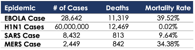
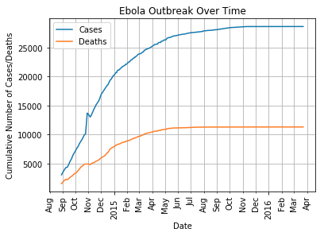
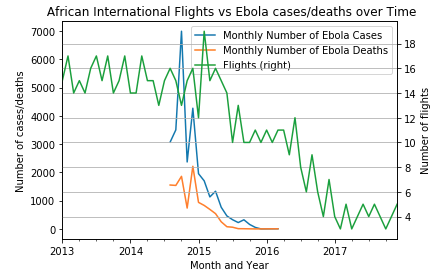
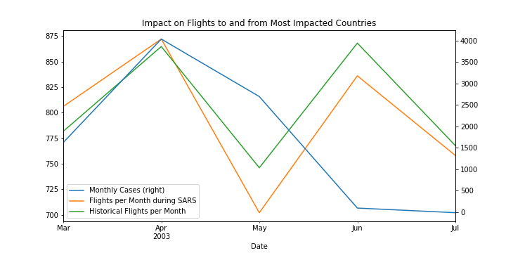
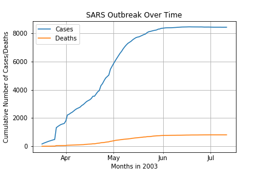
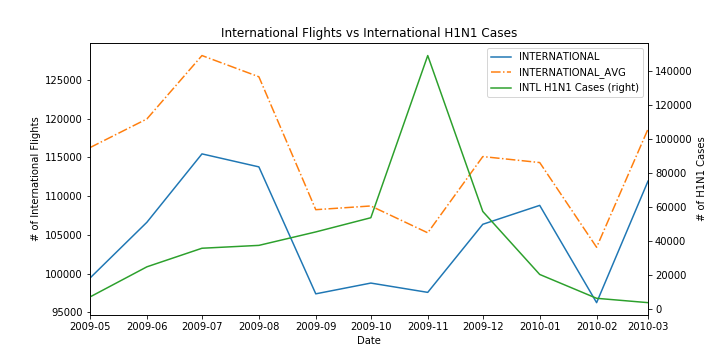
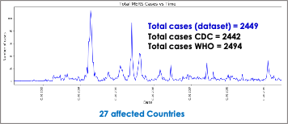
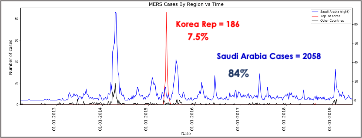
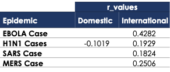

# Impact of Infectious Diseases on Flights

## Team Members
- Ryan Ashcraft
- Vikash Bhakta
- Luis Olguin
- Maria Soto

## Background and Motivation
The project was inspired by COVID-19’s massive recent impact on airline industry. We wondered have other disease outbreaks caused similar impacts on flying? Does the amount of an epidemic's cases or deaths influence the number of flights? Does the mortality rate play any significant role?

## Data Sources
1) Bureau of Transportation Statistics - https://www.transtats.bts.gov/Data_Elements.aspx?Data=2 - US flight data for domestic and international
2) Humanitarian Data Exchange (HDX) - https://data.humdata.org/dataset/ebola-cases-2014 - Ebola data
3) Kaggle - https://www.kaggle.com/imdevskp/sars-outbreak-2003-complete-dataset - SARS data
4) World Health Organization (WHO) - http://apps.who.int/flumart/Default?ReportNo=12 - H1N1 data
5) Kaggle -  https://www.kaggle.com/imdevskp - MERS data

## Flight Data
The total US domestic and international flights overall behavior between 2003 and 2019 is shown in the below plot. Flight data trend is cyclical and seasonal.

## Overall Epidemic Comparison
We decided to consider four epidemics with the aim of having broader responses and higher certainty on our results. The chart of the four diseases is displayed as follows. H1N1 has the highest number of estimated cases with the lowest mortality rate. Ebola and MERS have the higher mortality rates with 39.52% and 34.38%, respectively. 

## Ebola
Compared to the other epidemics Ebola did not have an impact on the number of flights flying from Africa to the US or vice versa. Due to the epidemic cases being mostly in west Africa (99%) there was no need to compare US domestic flight data versus the Ebola cases in the US (total in the US was 4). Also, there was very little flight data in west Africa before, during, and after the epidemic (< 15 flights average per month) so the data was easily skewed. Even though Ebola had the highest mortality rate of 39% out of all the epidemics there was no correlation between flights and cases. This might also be explained because most of the affected west African countries are underdeveloped and had very little number of flights going into them prior to the epidemic. The number of flights did fall after the epidemic but that could have been due to external factors such as an airline dropping that airport.

  

## SARS
SARS may have had a very slight impact on the number of flights between the United States and China, Canada, and Singapore - the countries most impacted by SARS. The number of flights between those countries during the SARS outbreak is consistently below the average number of flights for that same time period between 2002 and 2004, as seen in the chart below. 

However, when applying the data to calculate the correlation between number of flights and number of cases, there was not a statistically significant correlation (r value: 0.1824). 

SARS’s death count and case count rose at essentially the same rate, along the same timeline (shown below), so it was not possible to distinguish whether the amount of cases or the amount of deaths played a more significant role. Additionally, the fact that H1N1 and MERS appear to have similarly minimal impacts on flights as SARS (based on r value), but with much different mortality rates, indicates that mortality rate itself did not have an impact on flight numbers.

## H1N1
Based on the analysis, I do believe there was an impact on flights with H1N1 (“Swine Flu”). After taking the historical monthly average for both Domestic and International flights, you can clearly see (in the figure below) that the observed flights is below the historical average for the peak month of the H1N1 cases.

Ultimately, I feel both cases and deaths play a large role in how they can impact flights. For example, H1N1 had a large amount of cases (60M), but had a small mortality rate (<1%). Even though the deaths were low given the high amount of cases, I still saw an impact in the flights above. In comparison, EBOLA had a relatively small outbreak, but a high mortality rate. You can still see an impact on international flights for EBOLA. 

## MERS
This is an illness produced by a virus, specifically a coronavirus, known as Middle East Respiratory Syndrome Coronavirus - MERS-CoV (CDC). The MERS dataset was extracted from Kaggle. The data was already cleaned and organized by Country and Region. MERS number of deaths was not available. Therefore, mortality rate and total deaths were taken from WHO. 
The below chart shoes the total cases of MERS over Time, covering from March 2012 to June 2019. Our dataset shows total number of cases of 2449. CDC and WHO reported confirmed total cases varying 0.2% to 2% (approximately). A total of 27 countries were affected by this disease.

Saudi Arabia presented a total of 2058 confirmed cases and Republic of Korea reported 186 cases, covering 92% of total cases. The other 25 countries represent the remaining 8%. Saudi Arabia was selected of the most representative country to display the relationship between MERS and flights frequency.

The visual impact of MERS on flights that come from and go to Saudi Arabia is represented in the below plot. The green line shows the flight frequency and the blue line shows the MERS cases along the same time period (2012 – 2019). No historical data was analyzed due to the disease time length. The red arrows in this chart show a clear visual relationship between MERS cases increase and decrease with number of flights. 

It is important to mention that our flight dataset only considered Saudia airlines. This is one of the 21 airlines that have flights from United States to Saudi Arabia. More data availability should provide more facts regarding the actual correlation between flights and MERS cases. The current correlation contains an r_value of 0.25, which reflects that there is non meaningful significance among datasets. However, a trend can be visualized. Thus, further data availability should clarify the relationship existence.

## Conclusions 
Based on r value results, flight and epidemic data do not show a statistically significant correlation.

•	More flight data points are necessary to increase certainty regarding the Epidemics impact on Flights
•	The flight data shows a cyclical behavior throughout the years, which makes pinpointing the impact of our diseases more difficult
•	There is not a statistically significant correlation between flight and epidemic datasets
•	Higher outbreaks seem to negatively impact flight frequency
•	There seems to exist an impact of epidemics on flight frequency. However, there is uncertainty in this regard since we do not have sufficient data to backup this correlation
